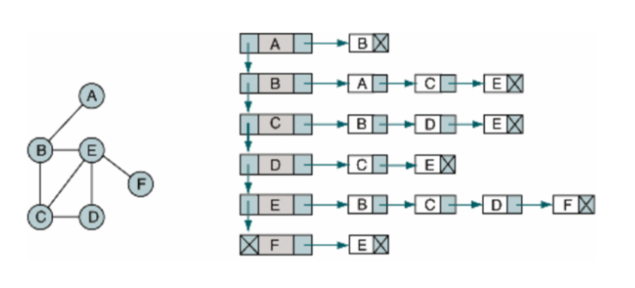

# 그래프의 기초

## 전반적인 용어

### 그래프의 정의
* `그래프`는 여러 `노드` (혹은 `정점`)이 `간선`으로 연결된 `추상 네트워크`를 이르는 말이다.
* `그래프`는 `G = (V,E)` 형식으로 표현된다.
> 노드 집합의 대표적인 형식 :    
> **V =({a,b,c,d}, {{a,b}, {b,c}, {c,d}, {d,a}})**

### 그래프의 방향
* 그래프에는 `유향 그래프`와 `무향 그래프`가 존재한다.    

|유향 그래프|무향 그래프|
|:---:|:---:|
|`방향이 있는 그래프`로 `말단 노드`가 존재|`방향 지정`이 없음|
|두 개의 `노드`사이에 2개의 `간선`|`간선`은 1개이며, `인접`이자 `이웃`|

### 부분 그래프
* `부분 그래프`는 그래프 G에서 집합 V와 E로 구성된 **그래프의 일부**다.
* 여기서 `유도 부분 그래프`는 부분 그래프의 부분 그래프다.
* `신장 부분 그래프`는 **원본 그래프의 모든 노드**를 포함하는 부분 그래프이다.

### 완전 그래프와 연결 요소
* `완전 그래프` 상에서는 그래프의 모든 노드가 서로 `인접`하다.
* `무향 그래프` 상에서 모든 노드가 다른 모든 노드로 가는 경로가 존재할 때 `연결`되어있다고 한다.
* `연결 요소`는 모든 노드가 연결된 **최대 부분 그래프**이다.
* `유향 그래프`에서 모든 노드가 `연결`되어 있으면 `강하게 연결`되어 있다고 한다.

## 이웃 함수
* 그래프의 `이웃 함수`는 V의 컨테이너로, `인접 리스트`와 `인접 행렬`이 알려져 있다.

### 인접 리스트
* `인접 리스트` 상에서는 각 노드에서 이웃 리스트에 접근이 가능하다.   



```python
# set으로 구현하기
a, b, c, d, e, f = range(6)
N = [{b,c,d,f}, {a,d,f}, {a,b,d,e}, {a,e}, {a,b,c}, {b,c,d,e}]
>>> b in N[a] # True
>>> b in N[b] # False
>>> len(N[f]) # 4
```
```python
# dictionary (key:value)로 구현
a, b, c, d, e, f = range(6)
N = {'a': set('bcdf'), 'b':set('adf'), 'c':set('abde'), 'd':set('ae'), 'e':set('abc'), 'f':set('bcde')}
>>> 'b' in N['a'] # True
>>> len(N['f']) #4
```
### 인접하는 행렬
* 각 노드의 `모든 이웃`에 대해 `하나의 행`을 갖는다.
* 각 행의 값은 1 (True)와 0 (False)로 이루어진다.
* 인접 행렬은 **중첩 리스트**로 간단하게 구현할 수 있다.
* 행렬의 **대각선** (diagonal) 요소는 항상 0이다.
* `인접 행렬` 상에서 무향 그래프는 `대칭`이며, 가중치를 추가하려면 다른 숫자를 추가한다.
* 간선을 찾는 복잡도는 `O(1)`이며, 이웃을 순회하는 복잡도는 `O(n)`이다.
```python
a, b, c, d, e, f = range(6)
N = [[0,1,1,0,0,1], [1,0,0,1,0,1], [1,1,0,1,1,0], [1,0,0,0,1,0], [1,1,1,0,0,0], [0,1,1,1,1,0]]
>>> N[a][b] # 1
>>> N[a][e] # 0
>>> sum(N[f]) # 차수 # 4
```
### 트리와의 연결점

* 그래프에서 어떤 노드는 **다중 참조**될 수 있으나, `트리`는 하나의 **부모 노드에 의해서만** 참조된다.
* `루트 노드`는 부모가 없는 와드이며, 부모 노드를 참조하는 노드는 `자식 노드`이다.
```python
#  class형태로 표현하고
# _repr_을 바꿔서 트리 형태를 표현할 수 있도록
class SimpleTree(object):
    def __init__(self, value = None, children = None):
        self.value = value
        self.children = children
        if self.children is None: 
            self.children = []
    def __repr__(self, level = 0):
        ret = "\t"*level + repr(self.value) + "\n"
        for child in self.children:
            ret += child.__repr__(level+1)
        return ret
```
```python
# bunchclass를 가지고 딕셔너리 특수화를 실시

class BunchClass(dict): # dict를 상속
    def __init__(self, *args, **kwargs):
        super(BunchClass, self).__init__(*args, **kwargs)
        self.__dict__ = self # __dict__ 객체를 통해서 dict로 변환한다.

def main():
    bc = BunchClass
    tree = bc(left = bc(left="Buffy", right = "angel"),
              right = be(left="Willow", right = "Xander"))
    print(tree)
```
------
* [`__dict__`객체에 대하여](https://minimilab.tistory.com/58)
* [`super()`에 대한 설명](https://velog.io/@gwkoo/%ED%81%B4%EB%9E%98%EC%8A%A4-%EC%83%81%EC%86%8D-%EB%B0%8F-super-%ED%95%A8%EC%88%98%EC%9D%98-%EC%97%AD%ED%95%A0)