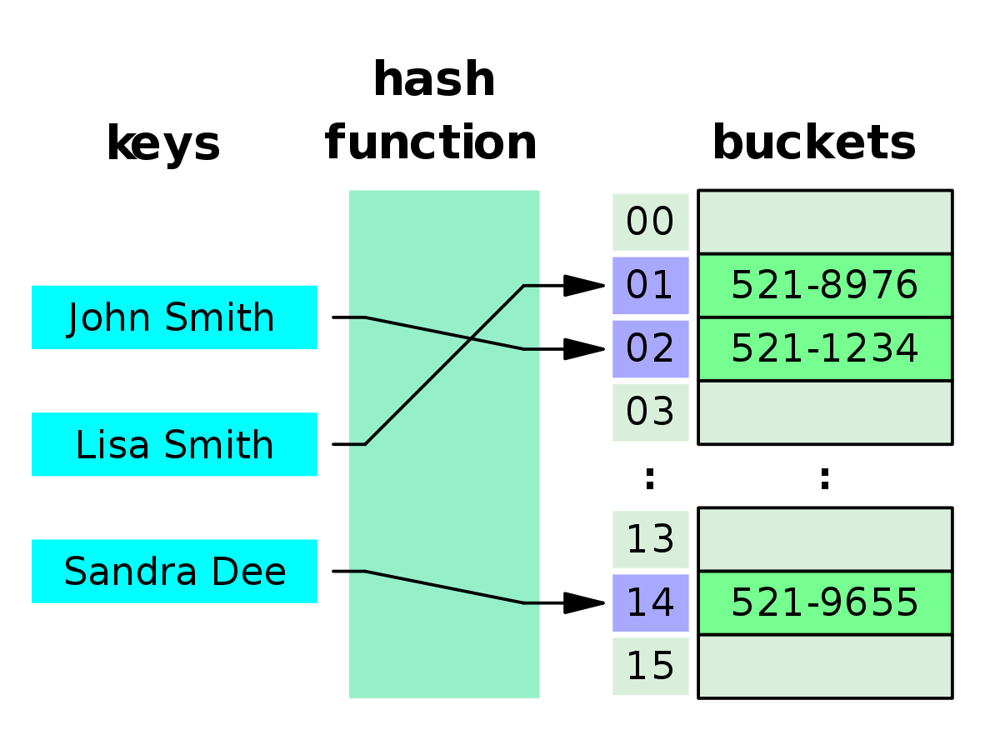

# 추상 데이터 타입 (3)

## 연결 리스트 (Linked List)

* `값`과 `다음 포인터`가 포함된 노드로 이루어진 `선형 리스트` 이다.
* 마지막 노드에는 `null`값을 가지게 된다.
* 연결 리스트를 통해서 `스택`이나 `큐`를 구현할 수 있다.
* 연결 리스트의 크기는 **동적**, 즉 항목의 수를 **알 수 없는 경우** 유용한다,
* 삽입 시간 복잡도는 `O(1)`이고, 검색 및 삭제는 `O(n)`에 해당한다. 
```python
# 노드의 구현
class Node(object):
    def __init__(self, value = None, pointer = None):
        self.value = value
        self.pointer = pointer

    def getData(self):
        return self.value
    
    def getNext(self):
        return self.pointer

    def setData(self, newdata):
        self.value = newdata

    def setNext(self, newpointer):
        self.pointer = newpointer
```

```python
# 후입선출 연결 리스트로 구현
# 뒤로 넣고 return할 때에는 앞으로 

from node import Node

class LinkedListLIFO(object):
    def __init__(self):
        self.head = None
        self.length = 0
    
    def _printList(self):
        node = self.head
        while node:
            print(node.value, end = " ")
            # node -> node.pointer로 이동한다.
            node = node.pointer
        point()
    
    # 이전 노드 (prev)를 기반으로 노드 (node)를 삭제한다.
    def _delete(self, prev, node):
        # self.length로 -1
        self.length -= 1
        if not prev:
            self.head = node.pointer
        else:
            prev.pointer = node.pointer
    
    # 새 노드를 추가한다
    # 다음 노드로 헤드를 가리키고, 헤드는 새 노드!
    def _add(self, value):
        self.length += 1
        self.head = Node(value, self.head)
    
    # 인덱스로 노드를 찾는다.
    def _find(self, index):
        prev = None
        node = self.head
        i = 0
        while node and i < index:
            prev = node
            # 순회를 하는 형식으로 진행한다.
            node = node.pointer
            i += 1
        return node, prev, i
    
    def _find_by_value(self, value):
        prev = None
        node = self.head
        found = False
        while node and not found:
            if node.value == value:
                found = True # break 요인
            else:
                prev = node
                node = node.pointer
        return node, prev, found
    
    # 특정 index에 위치한 node를 찾아서 삭제한다.
    def deleteNode(self, index):
        node, prev, i = self._find(index)
        if index == i:
            self._delete(prev, node)
        else:
            print(f"인덱스 {index}에 해당하는 노드가 없습니다.")
    
    def deleteNodeByValue(self, value):
        node, prev, found = self._find_by_value(value)
        if found:
            self._delete(prev, node)
        else:
            print(f"값 {value}에 해당하는 노드가 없습니다.")
```

```python
# FIFO, 즉 먼저 들어가고 먼저 것이 나가는 연결 리스트
from node import Node

class LinkedListFIFO(object):
    # fifo 연결 리스트의 경우에는 tail이 존재
    def __init__(self):
        self.head = None
        self.length = 0
        self.tail = None
    
    def _printList(self):
        node = self.head
        while node:
            print(node.value, end = " ")
            node = node.pointer

    def _addfirst(self, value):
        self.length = 1
        node = Node(value) # 추가
        self.head = node # head로 인정
        self.tail = node # 이거 하나 밖에 없는 경우

    def _deletefirst(self):
        self.length = 0
        self.head = None
        self.tail = None
        print("연결 리스트가 비었습니다.")
    
    # 새 노드를 추가한다!
    # 테일이 있다면, 테일의 다음 노드는 새 노드
    # 테일은 새 노드를 가리킨다
    def _add(self, value):
        self.length += 1
        node = Node(value)
        if self.tail:
            self.tail.pointer = node
        self.tail = node

    # 새노드를 추가한다
    def addNode(self, value):
        if not self.head:
            self._addFirst(value)
        else:
            self._add(value)

    # 인덱스로 노드 찾기
    def _find(self, index):
        prev = None
        node = self.head # head에서 시작
        i = 0
        while node and i < index: # node를 순회
            prev = node
            node = node.pointer
            i += 1
        return node, prev, i

    def _find_by_value(self, value):
        prev = None
        node = self.head
        found = false
        while node and not found:
            if node.value == value:
                found = True
            else:
                prev = node
                node = node.pointer
        return node, prev, found

    def deleteNode(self, index):
        # 인덱스로 찾아서 노드를 삭제한다
        # 만약 self.head가 없거나 pointer가 없다면
        # 그냥 first만 삭제하면 node가 삭제
        if not self.head or not self.head.pointer:
            self._deletefirst()
        else:
        # 아니면은 앞에서 prev, node, i 정보 _find(index) 찾고
        # 만약 찾고자 하는 index이고 node가 있으면
        # 일단 length 하나 줄이고 시작한다 (FIFO) 이므로 앞으로 나간다
            node, prev, i = self._find(index)
            if i == index and node:
                self.length -= 1
                # 만약 그게 퍼스트이거나 앞에 prev가 없으면
                if i == 0 or not prev:
                    self.head = node.pointer
                    self.tail = node.pointer
                # 중간에 것을 삭제하는 경우에는
                # prev의 pointer를 지우고자 하는 노드의 다음으로 전환
                # 그러면 지우고자 하는 node는 바로 사라짐
                else:
                    prev.pointer = node.pointer
            else:
                print("No Value")

    def deleteNodeByValue(self, value):
        if not self.head or not self.head.pointer:
            self._deletefirst()
        else:
            node, prev, i = self._find_by_value(value)
            if node and node.value == value:
                self.length -= 1
                if i == 0 or not prev:
                    self.head = node.pointer
                    self.tail = node.pointer
                else:
                    prev.pointer = node.pointer
            else:
                print("No node")
```
## 해쉬 테이블 (Hash Table)
* `키`와 `값`을 연결하여, 0또는 1개의 값과 연관된다.
* 각 키에는 `해시 함수` 계산이 전제되어야 한다.
* 2+개의 `키`가 동일한 `버킷`에 배정되어 `해시 충돌`이 일어날 수 있다.
* `해시 충돌`을 방지하는 법 중 하나는, **키-값의 연결 리스트를 저장**하는 것.
* 해시 테이블의 조회, 삽입, 삭제 시간 복잡도는 모두 `O(1)`이며, 충돌 시에는 `O(n)`에 해당한다.

```python
from linkedListFIFO import LinkedListFIFO

class HashTableLL(object):
    def __init__(self, size):
        self.size = size
        self.slots = []
        self._createHashTable()
        
    def _createHashTable(self):
        for i in range(self.size):
            self.slots.append(LinkedListFIFO())
    
    def _find(self, item):
        return item % self.size
    
    def _add(self, item):
        index = self._find(item)
        self.slots[index].addNode(item)

    def _delete(self, item):
        index = self._find(item)
        self.slots[index].deleteNodeByValue(item)

    def _print(self):
        for i in range(self.size):
            print("슬롯 (slot) {0}".format(i))
            self.slots[i]._printList()

def test_hash_tables():
    H1 = HashTableLL(3) # slot 3개 생성
    for i in range(0, 20):
        H1._add(i)
    H1._print()
    print("\n 항목 0, 1, 2를 삭제합니다.")
    H1._delete(0)
    H1._delete(1)
    H1._delete(2)

if __name__ == "__main__":
    test_hash_tables()
```